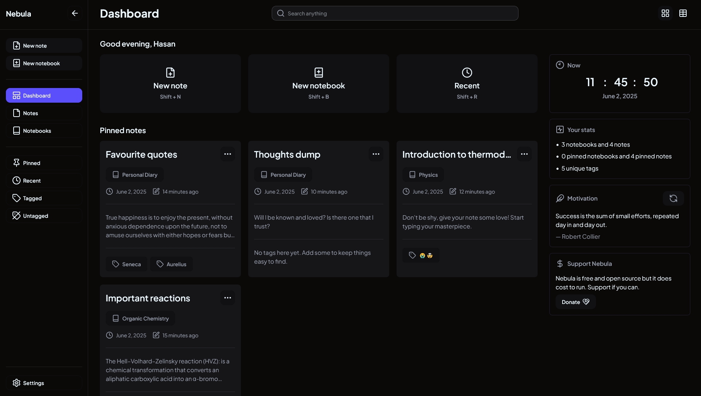
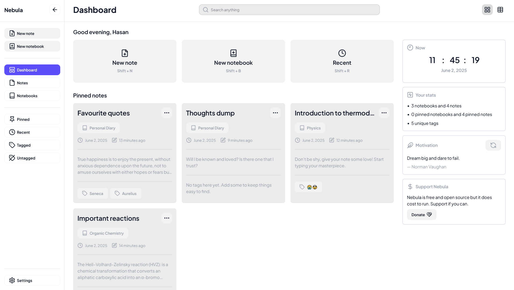

# 🌌 Nebula

<!-- AUTO-PACKAGE-BADGES:START -->

<!-- AUTO-PACKAGE-BADGES:END -->
Nebula is a powerful, minimalistic, and open-source note-taking app that helps you stay organized and focused. With a clean interface, support for multiple notebooks, and a beautiful editing experience, Nebula is designed for productivity and peace of mind.

## 🚀 Features

- 📝 Rich-text note editing with autosave
- 📁 Organize notes into multiple notebooks
- 🌗 Light & dark mode toggle
- 🔎 Fast search with tag and notebook filters
- 🔐 Secure Firebase authentication
- ➕ And more!

## 🛠 Tech Stack

- **Frontend:** React + Vite + Tailwind CSS + DaisyUI
- **Backend:** Firebase (Firestore and Authentication)
- **State Management:** Zustand
- **Deployment:** Vercel

## 🌍 Production Version

- The fully deployed, production-ready Nebula app is available at:
[https://trynebulanotes.vercel.app](https://trynebulanotes.vercel.app)

## 📷 Screenshots

## 🌟 Contributing

- Thank you for taking the time to contribute. To learn more about how to make your first contribution to Nebula, have a look at [CONTRIBUTING.md](CONTRIBUTING.md)

## 💸 Support

- Nebula is free and open source, but it does cost to run. If you'd like to support us, you can do so [here](https://ko-fi.com/hasan04)

